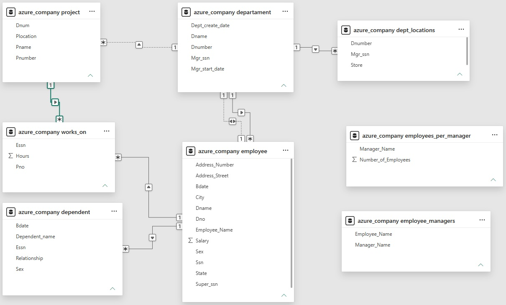
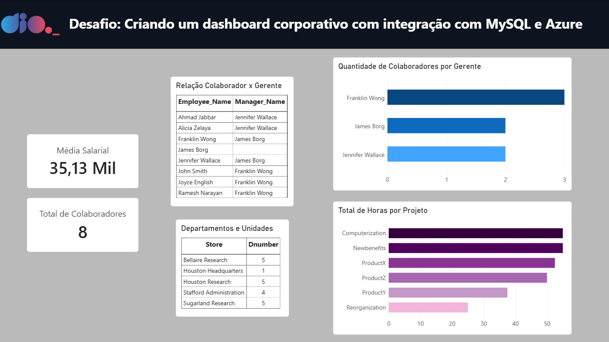

# 📊 Desafio: Criando um dashboard corporativo com integração com MySQL e Azure

## 📌 Sobre o desafio

O objetivo deste projeto foi conectar o Power BI a uma base de dados relacional hospedada no Azure MySQL (`azure_company`), realizando o processo completo de ETL (Extração, Transformação e Carga) no Power Query e estruturando um modelo dimensional para análise corporativa.

O desafio consistiu em tratar dados brutos, corrigir inconsistências de relacionamentos, criar agregações hierárquicas e consolidar as informações em um relatório corporativo interativo.

---

## 🎯 Objetivos do desafio

- Conectar o Power BI ao banco de dados relacional Azure MySQL;
- Realizar a limpeza, transformação e padronização dos tipos de dados de 6 tabelas base;
- Tratar e justificar registros com valores nulos na hierarquia corporativa;
- Separar colunas complexas de endereço e mesclar nomes de colaboradores;
- Criar a combinação de departamentos e unidades/localidades;
- Construir a tabela de relacionamento entre colaboradores e seus respectivos gerentes;
- Calcular e visualizar a quantidade de colaboradores liderados por cada gerente;
- Resolver caminhos ambíguos de relacionamentos no modelo dimensional (*Star Schema*);
- Desenvolver um dashboard corporativo contendo cartões métricos, tabelas relacionais e gráficos de esforço/horas;
- Submeter o projeto através do GitHub.

---

## 🛠️ Etapas de ETL e Modelagem de Dados

### 1. Limpeza e Tipagem de Dados
- **Padronização:** Chaves identificadoras (`Ssn`, `Essn`, `Super_ssn`) foram tipadas estritamente como **Texto**; dados de remuneração e horas foram configurados como **Número Decimal**.
- **Remoção de Colunas Técnicas:** Eliminação de colunas de navegação relacional automáticas geradas pelo conector (`Value` / `Table`).

### 2. Tratamento de Nulos e Transformações de Texto
- **Integridade Hierárquica:** O valor nulo em `Super_ssn` da tabela `employee` foi mantido de forma intencional, pois identifica o topo da hierarquia executiva (diretor-geral sem gestor imediato).
- **Tratamento de Endereço:** Divisão da coluna composta `Address` por delimitador de vírgula, gerando `Address_Number`, `Address_Street`, `City` e `State`.
- **Unificação de Nomes:** Concatenação de `Fname` e `Lname` em `Employee_Name` com descarte da inicial isolada (`Minit`).
- **Unidades Organizacionais:** Mesclagem entre `dept_locations` e `departament` para criação do atributo unificado `Store`.

### 3. Hierarquia e Agrupamentos
- **`azure_company employee_managers`:** Tabela criada via *Left Outer Join* para mapear nominalmente cada colaborador ao seu respectivo gestor.
- **`azure_company employees_per_manager`:** Agrupamento dimensional contando o volume exato de colaboradores alocados sob a liderança de cada gerente.

### 4. Resolução de Ambiguidade no Modelo Dimensional
- Resolução do ciclo fechado de filtros (*loop*) entre as dimensões e a tabela fato `works_on`.
- O relacionamento entre `project (Dnum)` e `departament (Dnumber)` foi mantido inativo para viabilizar a ativação direta do vínculo essencial entre a fato `works_on (Pno)` e a dimensão `project (Pnumber)` ($*:1$).

---

## 📊 Estrutura do Dashboard

O dashboard foi construído em página única, organizado nos seguintes blocos visuais:

- **Métricas Globais:** Cartões com o total de colaboradores e média salarial;
- **Matriz de Hierarquia:** Tabela exibindo o vínculo nominal Colaborador x Gerente;
- **Gestão de Equipes:** Gráfico de barras horizontais indicando a quantidade de subordinados diretos por gerente;
- **Departamentos e Unidades:** Tabela relacionando os setores às suas localidades (`Store`);
- **Esforço por Projeto:** Gráfico de barras detalhando o volume total de horas trabalhadas por projeto corporativo.

---

## 🛠️ Ferramentas utilizadas

- Azure Database for MySQL
- Power BI Desktop (Power Query & Model View)
- GitHub

---

## 🚀 Aprendizados

Este projeto permitiu consolidar na prática o fluxo de trabalho de ponta a ponta em Business Intelligence: desde a conexão com serviços em nuvem (Azure) até a modelagem dimensional avançada. 

Foram desenvolvidas competências em **transformação de strings, mesclagem e expansão de consultas, tratamento de hierarquias corporativas com valores nulos, resolução de ambiguidades relacionais e design analítico de dashboards**.
