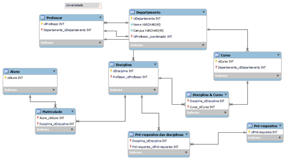
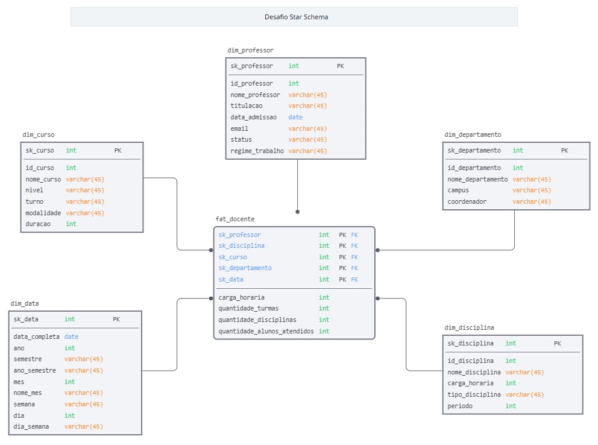

# 📊 Desafio de Projeto: Modelagem Dimensional de Sistema Acadêmico com Star Schema

## 📌 Sobre o desafio

O objetivo deste projeto consistiu na criação de um modelo dimensional em **Star Schema (Esquema Estrela)** voltado para a análise de desempenho e gestão de atuação docente em uma universidade.

A proposta partiu do modelo relacional transacional de uma universidade disponibilizado no curso:

A partir dessa estrutura normalizada, a arquitetura de dados foi reformulada com foco analítico exclusivo na **atividade do professor**: carga horária, departamentos atendidos e disciplinas ministradas, desconsiderando entidades transacionais de alunos, matrículas e tabelas associativas intermediárias que não agregam ao contexto docente.
---

## 🎯 Objetivos do desafio

- Converter um banco de dados relacional acadêmico em um esquema analítico dimensional (Star Schema);
- Definir a tabela fato centrada na rotina do corpo docente e na oferta de aulas;
- Estabelecer as métricas aditivas do processo de ensino;
- Estruturar as dimensões descritivas necessárias (Professor, Disciplina, Curso e Departamento) sem ramificações complexas;
- Modelar uma dimensão de tempo (`dim_data`) do zero para viabilizar o acompanhamento histórico por ano, semestre e sazonalidade;
- Aplicar o uso de chaves substitutas (*Surrogate Keys*) para assegurar integridade no Data Warehouse e desvincular o modelo dos identificadores transacionais de origem.

---

## 🛠️ Arquitetura Dimensional e Modelagem de Dados

### 1. Granularidade e Tabela Fato
A tabela central **`fat_docente`** representa a alocação de um docente ministrando uma disciplina para determinado curso e departamento.
- **Chaves Estrangeiras (Composição da PK):** `sk_professor`, `sk_disciplina`, `sk_curso`, `sk_departamento`, `sk_data`.
- **Métricas Aditivas / Fatos:**
  - `carga_horaria`: Total de horas dedicadas pelo docente naquele período/disciplina.
  - `quantidade_turmas`: Quantidade de turmas atendidas.
  - `quantidade_disciplinas`: Quantidade de disciplinas ministradas.
  - `quantidade_alunos_atendidos`: Quantidade de discentes sob instrução do professor no período.

### 2. Dimensões Analíticas (Desnormalização e Atributos)
- **`dim_professor`:** Reúne dados cadastrais e funcionais do corpo docente (`nome_professor`, `titulacao`, `data_admissao`, `email`, `status`, `regime_trabalho`).
- **`dim_disciplina`:** Contém as características curriculares desnormalizadas (`nome_disciplina`, `carga_horaria`, `tipo_disciplina`, `periodo`).
- **`dim_curso`:** Descreve a estrutura da oferta educacional com granularidade analítica (`nome_curso`, `nivel`, `turno`, `modalidade`, `duracao`).
- **`dim_departamento`:** Unifica as informações estruturais da universidade (`nome_departamento`, `campus`, `coordenador`).
- **`dim_data`:** Dimensão de tempo para possibilitar análises de evolução anual e sazonal (`data_completa`, `ano`, `semestre`, `ano_semestre`, `mes`, `nome_mes`, `semana`, `dia`, `dia_semana`).

---

## 📐 Diagrama Conceitual (Star Schema)

---

## 🛠️ Ferramentas utilizadas

- [SqlDBM](https://sqldbm.com/)
- GitHub

---

## 🚀 Aprendizados

Este desafio consolidou conceitos fundamentais da modelagem dimensional orientada pelo método de Ralph Kimball:

- Transição assertiva de regras de negócio de ambientes relacionais para esquemas dimensionais orientados a consultas analíticas.
- Identificação precisa da granularidade de processos de negócio docentes e separação clara entre medidas numéricas e atributos contextuais.
- Planejamento de dimensões temporais (`dim_data`) essenciais para BI.
- Criação de modelos com alta performance para análises no Power BI, eliminando ambiguidades e relacionamentos circulares.
