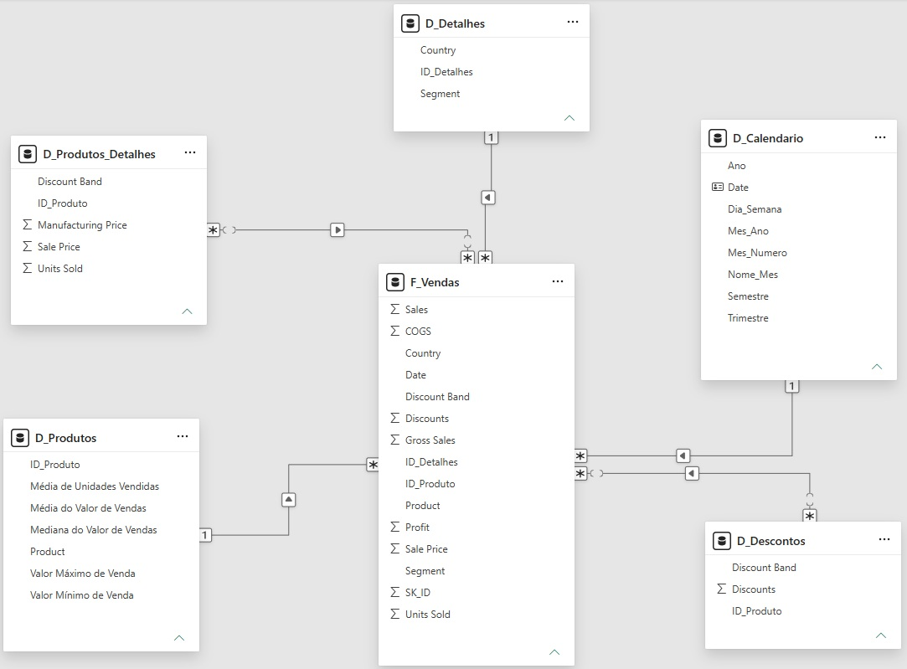
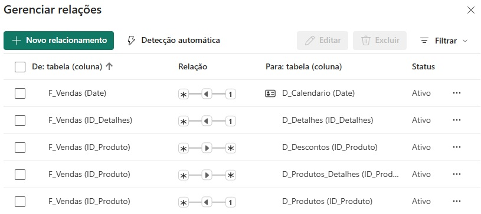
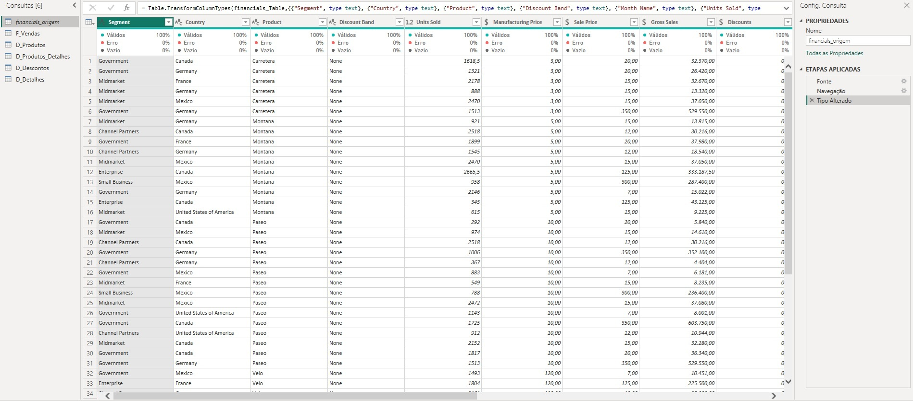
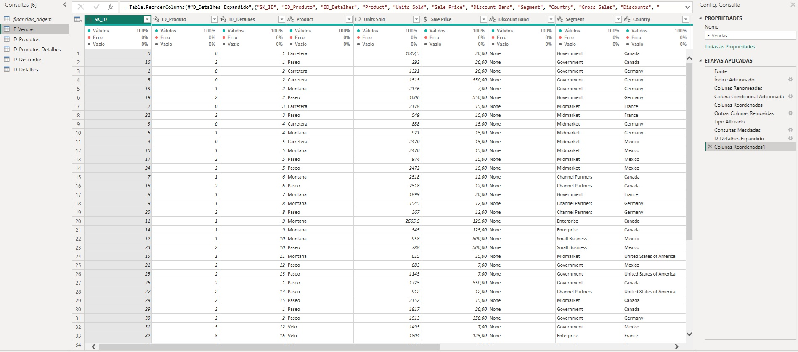
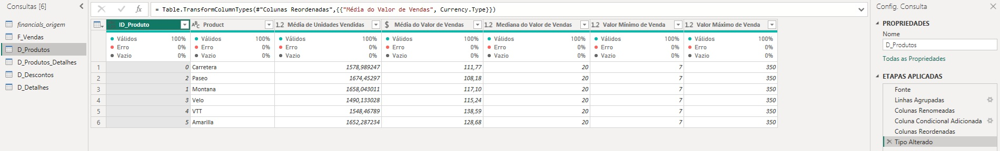
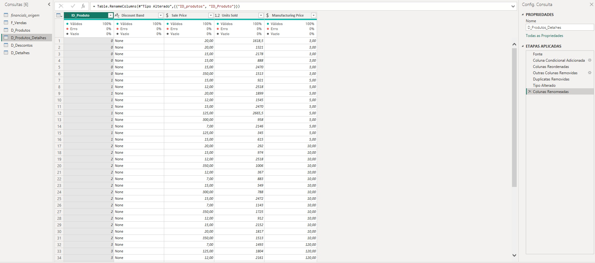
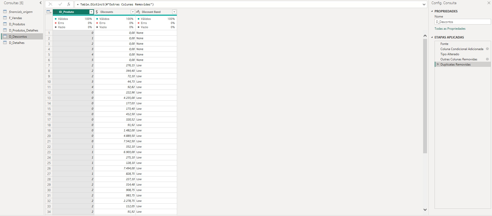
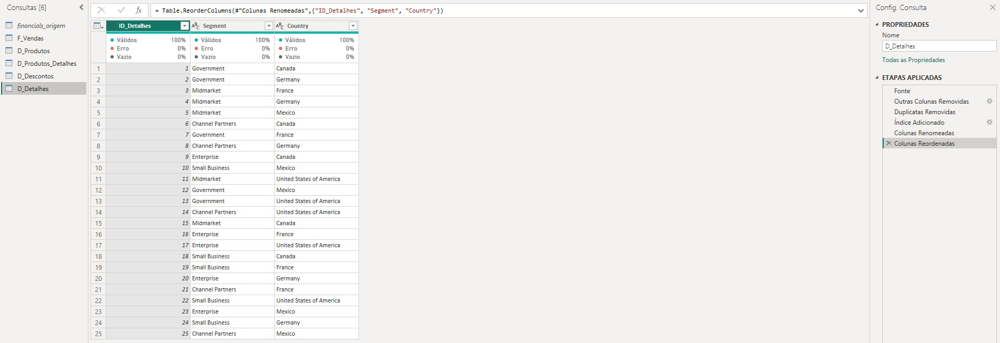

# 📊 Desafio: Modelando um Dashboard de E-commerce com Power BI Utilizando Fórmulas DAX

## 📌 Sobre o desafio

O objetivo foi transformar uma tabela única e desnormalizada da base de dados **Financials Sample** em um modelo dimensional analítico estruturado em **Star Schema** (Esquema em Estrela). 

O desafio consistiu na criação de tabelas fato e dimensão a partir do Power Query e da linguagem DAX, implementando chaves substitutas (*Surrogate Keys*), resolvendo redundâncias e configurando os relacionamentos necessários para otimização de consultas e relatórios analíticos.

---

## 🎯 Objetivos do desafio

- Criar a tabela de backup/área de preparação (`financials_origem`) e desabilitar sua carga para o modelo em memória;
- Construir a tabela fato `F_Vendas` contendo as métricas de negócio e chaves relacionais;
- Desenvolver as tabelas dimensão `D_Produtos`, `D_Produtos_Detalhes`, `D_Descontos` e `D_Detalhes` no Power Query;
- Criar chaves substitutas (*Surrogate Keys*) utilizando colunas de índice e regras condicionais;
- Realizar agrupamentos avançados com cálculos estatísticos de vendas e precificação;
- Gerar a tabela temporal `D_Calendario` utilizando funções DAX e marcá-la como tabela oficial de datas;
- Configurar os relacionamentos dimensionais ($1:*$ e $*:*$) com direções de filtro adequadas na exibição de modelo;
- Submeter o projeto documentado através do GitHub.

---

## 📊 Estrutura do modelo de dados

O modelo dimensional foi implementado no padrão **Star Schema**, centralizando os fatos transacionais e conectando-os às dimensões analíticas.



### Relacionamentos do modelo

As conexões entre a tabela fato e as dimensões foram estabelecidas com integridade referencial e validação de cardinalidades:

- **`D_Calendario[Date]` $\rightarrow$ `F_Vendas[Date]`:** Relação $1:*$, filtro único (`D_Calendario` filtra `F_Vendas`).
- **`D_Detalhes[ID_Detalhes]` $\rightarrow$ `F_Vendas[ID_Detalhes]`:** Relação $1:*$, filtro único (`D_Detalhes` filtra `F_Vendas`).
- **`D_Produtos[ID_Produto]` $\rightarrow$ `F_Vendas[ID_Produto]`:** Relação $1:*$, filtro único (`D_Produtos` filtra `F_Vendas`).
- **`D_Descontos[ID_Produto]` $\leftrightarrow$ `F_Vendas[ID_Produto]`:** Relação $*:*$, filtro único (`D_Descontos` filtra `F_Vendas`).
- **`D_Produtos_Detalhes[ID_Produto]` $\leftrightarrow$ `F_Vendas[ID_Produto]`:** Relação $*:*$, filtro único (`D_Produtos_Detalhes` filtra `F_Vendas`).



---

## 🛠️ Detalhamento das tabelas

### 1. Base de Preparação — `financials_origem`
Utilizada como tabela raiz de *staging*. Nela foi realizada a padronização inicial dos tipos de dados de todas as colunas para que as consultas derivadas herdassem metadados consistentes. A opção **Habilitar Carga** foi desativada para evitar duplicação em memória.



---

### 2. Tabela Fato — `F_Vendas`
Centraliza os dados transacionais de vendas e as métricas financeiras. Possui a chave primária `SK_ID` criada por índice sequencial, o identificador `ID_Produto` derivado via coluna condicional e a chave estrangeira `ID_Detalhes` incorporada via mesclagem de consultas.



---

### 3. Dimensão — `D_Produtos`
Contém os registros únicos de cada produto e agrega métricas estatísticas calculadas via agrupamento no Power Query: média de unidades vendidas, média do valor de vendas, mediana do valor de vendas, além de valor mínimo e máximo de venda. Possui a *Surrogate Key* `ID_Produto`.



---

### 4. Dimensão — `D_Produtos_Detalhes`
Agrupa características complementares de comercialização dos itens. Composta pelas colunas `ID_Produto`, `Discount Band`, `Sale Price`, `Units Sold` e `Manufacturing Price`, tratada com remoção de duplicadas para consolidação dos atributos.



---

### 5. Dimensão — `D_Descontos`
Armazena a distribuição de concessão de descontos contendo `ID_Produto`, os valores nominais de `Discounts` e a faixa de desconto (`Discount Band`), garantindo a granularidade com remoção de duplicadas.



---

### 6. Dimensão — `D_Detalhes`
Modela o contexto geográfico e de segmento de mercado. Isola os campos `Segment` e `Country` em 25 combinações exclusivas e indexadas pela chave numérica `ID_Detalhes` gerada via coluna de índice.



---

### 7. Dimensão Temporal — `D_Calendario`
Construída dinamicamente em DAX para suporte à inteligência temporal contínua no modelo. Foi configurada com a propriedade **Marcar como tabela de data** e teve a coluna `Nome_Mes` classificada numericamente por `Mes_Numero`.

```dax
D_Calendario = 
VAR DataMinima = MIN(F_Vendas[Date])
VAR DataMaxima = MAX(F_Vendas[Date])
RETURN
ADDCOLUMNS(
    CALENDAR(DataMinima, DataMaxima),
    "Ano", YEAR([Date]),
    "Mes_Numero", MONTH([Date]),
    "Nome_Mes", FORMAT([Date], "MMMM"),
    "Mes_Ano", FORMAT([Date], "MMM/YYYY"),
    "Trimestre", "T" & FORMAT([Date], "Q"),
    "Semestre", IF(MONTH([Date]) <= 6, "1º Semestre", "2º Semestre"),
    "Dia_Semana", FORMAT([Date], "dddd")
)
```
---

## 🛠️ Ferramentas utilizadas

- Power BI Desktop (Power Query e DAX Engine)
- GitHub

---

## 🚀 Aprendizados

Este projeto permitiu aprofundar os conceitos práticos de arquitetura dimensional e engenharia analítica no Power BI:

- Transição prática de um modelo plano desnormalizado para o modelo dimensional **Star Schema**;
- Criação e governança de **Surrogate Keys** com índices e condicionais de transformação;
- Agrupamento avançado com funções estatísticas em lote (`List.Average`, `List.Median`, `List.Min`, `List.Max`) no Power Query;
- Construção de dimensão calendário dinâmica com **DAX** e aplicação de boas práticas de ordenação e marcação temporal;
- Análise e resolução de cardinalidades complexas ($*:*$), garantindo a propagação correta dos filtros para a tabela fato.
