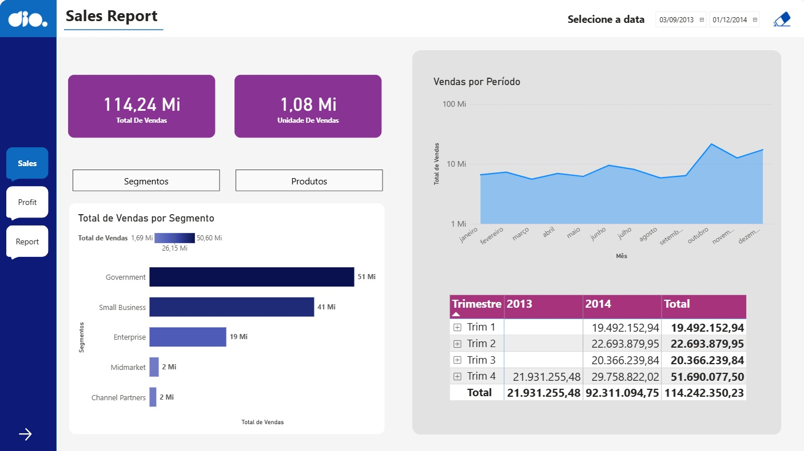
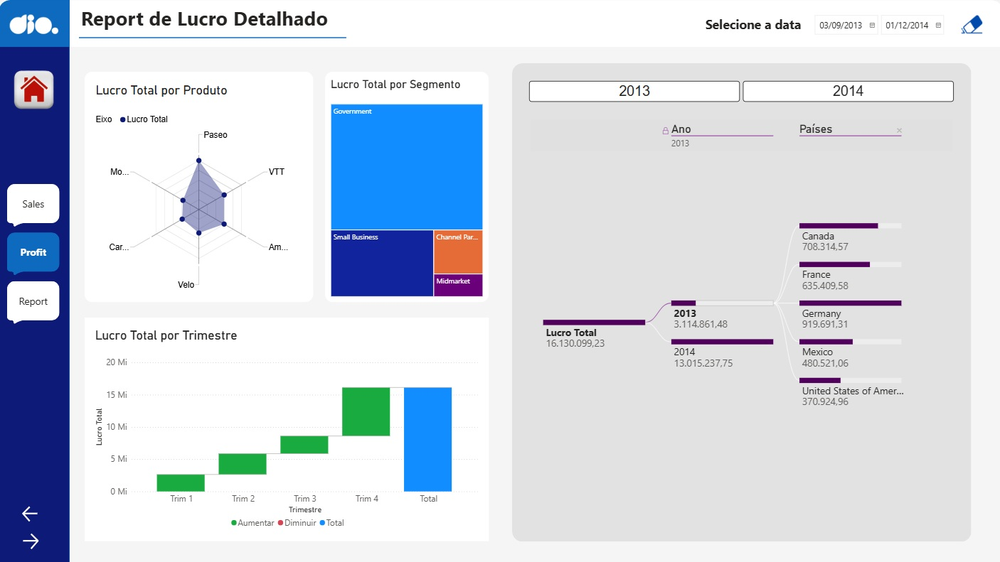
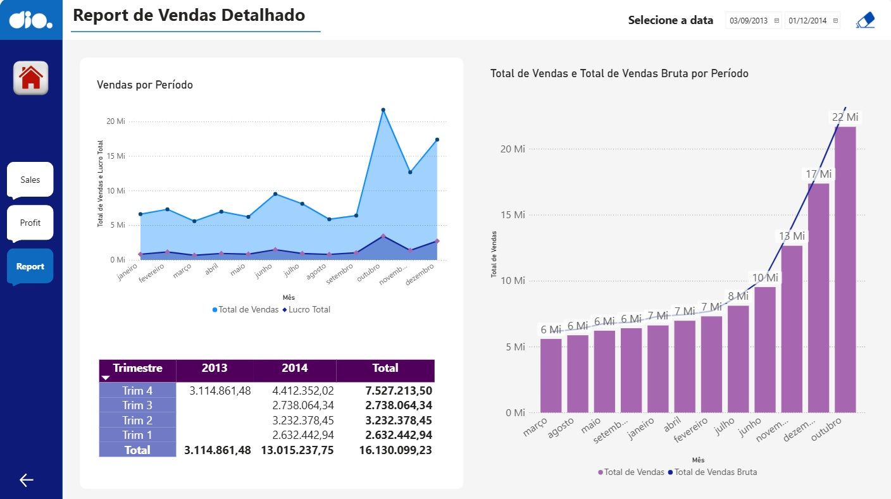

# 📊 Desafio: Atualizando Relatório Financeiro com Foco na Experiência do Usuário (UX/UI)

## 📌 Sobre o desafio

O objetivo foi reformular o relatório financeiro do [**módulo 3**](https://github.com/betaaum/Primeiros-Passos-em-Power-BI/tree/main/03%20-%20Visualiza%C3%A7%C3%A3o%20de%20Dados%20e%20Relat%C3%B3rios%20com%20Power%20BI) desenvolvido no Power BI utilizando a base de dados **Financials Sample**, aplicando princípios essenciais de Design, Usabilidade e Experiência do Usuário (UX/UI).

O projeto focou no aprimoramento do layout por meio de posicionamento estratégico de elementos visuais, contraste balanceado, proporção harmônica e implementação de um menu de navegação lateral padronizado entre as páginas. Além da reestruturação das páginas existentes, foi desenvolvida uma terceira página com matriz hierárquica detalhada de vendas e períodos.

---

## 🎯 Objetivos do desafio

- Reestruturar o layout das páginas aplicando conceitos de contraste, alinhamento e hierarquia visual;
- Construir um menu lateral unificado de navegação com estados interativos para seleção de página;
- Readequar os visuais da página de vendas com cartões de KPIs destacados e gráficos de área/linhas;
- Refinar a página de análise detalhada de lucro com árvore de decomposição, gráfico de radar e cascata;
- Criar a terceira página contendo uma matriz detalhada de vendas por trimestre e ano;
- Submeter o projeto documentado através do GitHub.

---

## 📊 Estrutura do relatório

O relatório é composto por três páginas integradas pelo menu lateral de navegação:

### Página 1 — Sales Report
Apresenta os principais indicadores macro do negócio:
- Cartões com cantos arredondados contendo os KPIs de Total de Vendas e Unidades Vendidas;
- Gráfico de barras horizontais com o Total de Vendas por Segmento;
- Gráfico de área contínuo exibindo a evolução temporal das vendas mês a mês;
- Matriz resumida com abertura de faturamento por trimestre e ano;
- Segmentador de data superior para controle temporal refinado.

### Página 2 — Report de Lucro Detalhado
Voltada para a compreensão dos fatores que impulsionam o resultado financeiro:
- Árvore de decomposição para análise exploratória de lucro por ano e país;
- Gráfico de radar destacando a distribuição de lucro entre os produtos da empresa;
- Treemap evidenciando o peso de cada segmento de mercado;
- Gráfico de cascata (*Waterfall*) ilustrando os ganhos acumulados ao longo dos trimestres;
- Segmentadores de ano e país.

### Página 3 — Report de Vendas Detalhado
Desenvolvida para aprofundamento analítico e detalhamento granular:
- Gráfico de linhas comparando a trajetória de Total de Vendas e Lucro Total por mês;
- Gráfico combinado de colunas e linhas apresentando Total de Vendas versus Vendas Brutas em ordem cronológica;
- Matriz hierárquica consolidando os valores por trimestre entre os anos de 2013 e 2014.

---

## 🛠️ Ferramentas utilizadas

- Power BI Desktop
- GitHub

---

## 🚀 Aprendizados

Este desafio consolidou a importância de pensar os painéis sob a ótica do usuário final:

- Aplicação técnica de padrões de escaneamento visual (leitura em Z, regra dos terços e proporção áurea) na organização dos visuais;
- Construção de interfaces de navegação com menus verticais e alternância de telas intuitiva;
- Identificação e correção de ordenações de eixos cronológicos em gráficos temporais;
- Combinação de múltiplos tipos visuais (cascata, decomposição, matriz hierárquica e gráficos combinados) para enriquecer o *storytelling* dos dados.
