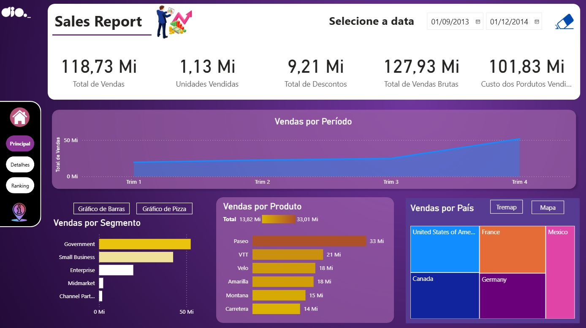
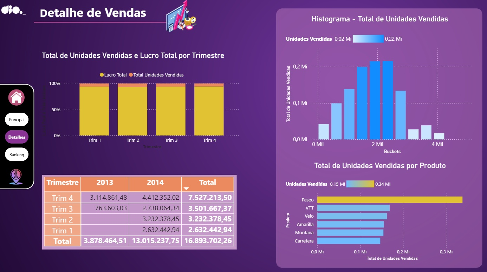
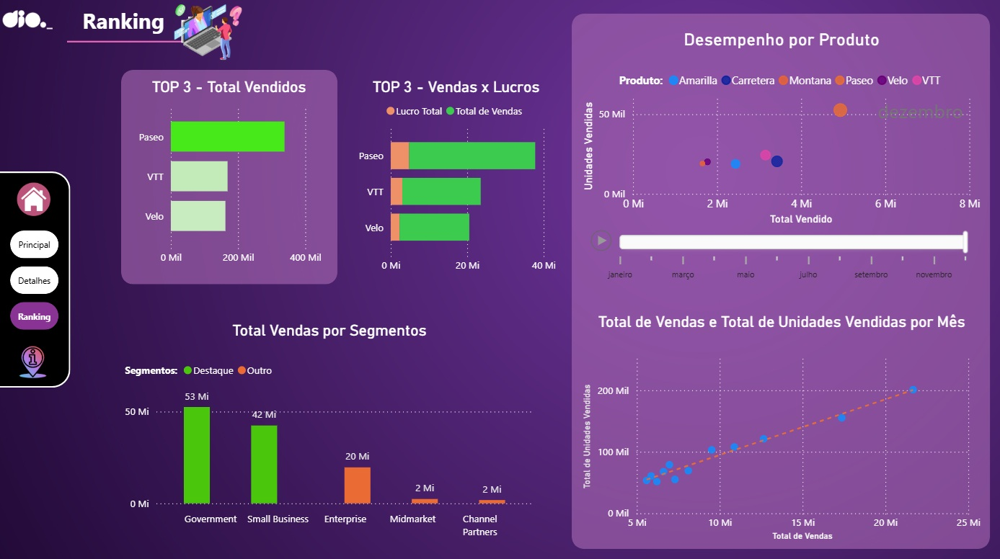

# 📊 Desafio: Criando um Dashboard Gerencial para Tomada de Decisões com Power BI

## 📌 Sobre o desafio

O objetivo deste projeto foi desenvolver um dashboard gerencial e analítico no Power BI Desktop utilizando a base de dados **Financials Sample**, focado em suporte à tomada de decisões estratégicas e storytelling de dados.

A solução foi estruturada para proporcionar uma navegação fluida ao usuário, partindo de uma página de entrada com apresentação visual do projeto, passando pela visão executiva principal e aprofundando em páginas dedicadas a detalhamento operacional, compartimentação estatística e análise de rankings.

---

## 🎯 Objetivos e Requisitos Atendidos

- **Capa de Apresentação (Storytelling):** Criação de uma landing page com identidade visual moderna e botão interativo de ação (*Call to Action* — "Explorar análise");
- **Navegabilidade Integrada:** Menu lateral vertical unificado conectando todas as telas do relatório (Home, Principal, Detalhes, Ranking e Informações);
- **Visuais de TOP 3 (Rankings):** Construção de visuais focados nos produtos líderes em volume comercializado e relação entre faturamento e lucratividade;
- **Análise de Dispersão e Correlação:** Visualização em dispersão avaliando a relação entre Unidades Vendidas e Total de Vendas por mês, incluindo linha de tendência e linha de reprodução temporal;
- **Compartimentação de Dados (*Buckets*):** Desenvolvimento de histograma de distribuição com segmentação de dados em faixas (*buckets*) de unidades comercializadas;
- **Agrupamentos Analíticos:** Segmentação visual de categorias destacadas versus secundárias para análise de concentração de mercado;
- **Detalhamento Matricial:** Matriz com abertura temporal consolidando o desempenho financeiro por trimestre e ano.

---

## 📊 Estrutura do Dashboard

O relatório conta com uma estrutura integrada de 4 telas:

### 1. Home (Capa do Relatório)
Tela inicial projetada para contextualizar o tema e guiar a experiência do usuário, contendo botão interativo para início imediato da navegação exploratória.

---

### 2. Visão Principal (Sales Report)
Painel macro executivo que reúne os principais indicadores de saúde comercial do negócio:
- Cartões superiores de KPIs consolidados (Total de Vendas, Unidades Vendidas, Descontos, Vendas Brutas e Custo dos Produtos Vendidos);
- Gráfico de área evidenciando a evolução temporal das vendas mês a mês;
- Gráfico de barras horizontais com vendas por segmento de clientes;
- Gráfico de barras com faturamento por linha de produtos;
- Visuais comparativos de participação por país (Treemap e Mapa).

---

### 3. Detalhe de Vendas
Página direcionada à investigação operacional e análise de distribuição estatística:
- Histograma de compartimentação (*buckets*) demonstrando a frequência e o volume de unidades vendidas;
- Gráfico de colunas 100% empilhadas comparando a proporção de Unidades Vendidas e Lucro Total por trimestre;
- Ranking de unidades vendidas por produto com formatação condicional;
- Matriz financeira com abertura analítica de faturamento por trimestre entre os anos de 2013 e 2014.

---

### 4. Ranking e Correlação Analítica
Painel estratégico para diagnóstico comparativo e identificação de padrões de rentabilidade:
- **TOP 3 Produtos:** Visuais com ranking dos produtos líderes em volume absoluto e análise combinada de Vendas versus Lucro;
- **Agrupamento de Segmentos:** Gráfico de barras destacando segmentos prioritários frente aos demais;
- **Gráficos de Dispersão:** Análise correlacional entre volume físico e financeiro com acompanhamento cronológico da evolução mensal dos produtos.

---

## 🛠️ Ferramentas e Recursos Utilizados

- **Power BI Desktop:** Modelagem de dados, criação de métricas DAX e desenvolvimento dos visuais
- **Compartimentação de Dados:** Agrupamento por intervalos numéricos (*Buckets/Bins*)
- **Filtros e Parâmetros:** Segmentadores dinâmicos, ranking TOP N e ordenação cronológica
- **Design & UX:** Menu lateral interativo, alinhamento visual e paleta corporativa
- **GitHub:** Controle de versão e documentação de portfólio

---

## 🚀 Principais Aprendizados

- Estruturação de dashboards gerenciais balanceando visão sintética (para tomadores de decisão) e analítica (para operadores e especialistas);
- Emprego de gráficos de dispersão para identificação de correlação direta entre esforço de vendas e retorno financeiro;
- Utilização de histogramas com compartimentação de dados para identificar gargalos e concentração de demandas;
- Implementação de rankings Top N para priorização de recursos e foco operacional sobre produtos de maior margem.
